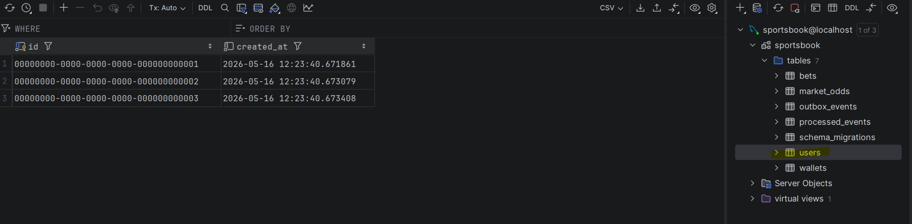
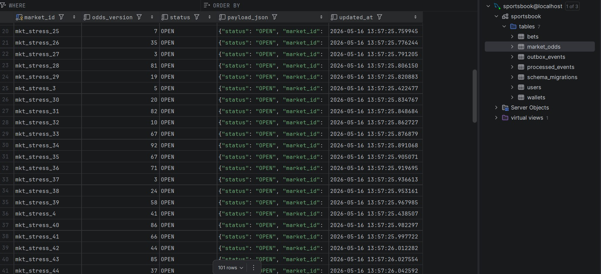
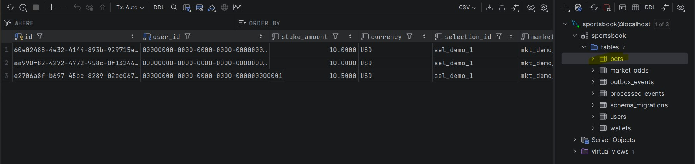
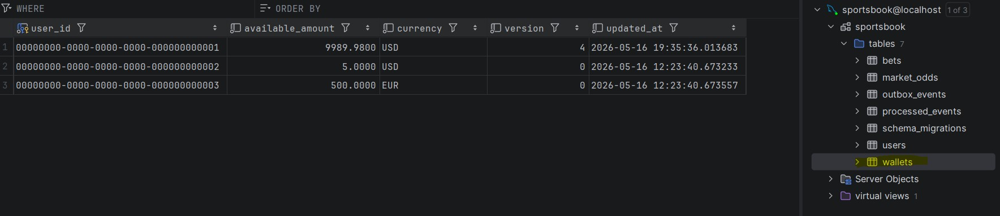
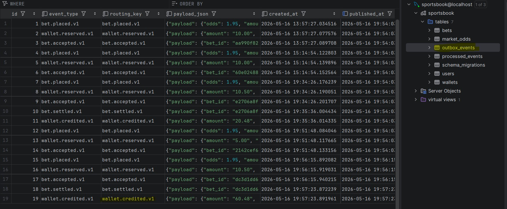
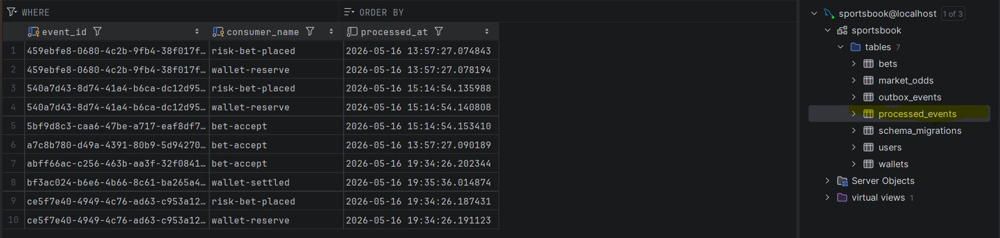

# Sportsbook EDA

Event-driven slice of a sportsbook stack in Go: **MySQL** (bets, wallets, transactional outbox), **RabbitMQ** (topic exchange, queues), **stdlib `net/http`**, and **Docker Compose**. 

This implementation demonstrates a robust **Choreography** pattern with high observability, idempotency, and business-aware validation (drift protection and market suspension).

## Prerequisites

- [Docker Desktop](https://www.docker.com/products/docker-desktop/) (or Docker Engine + Compose v2) with the daemon running
- [Go 1.25+](https://go.dev/dl/) if you want to run or test binaries on the host
- [Postman](https://www.postman.com/downloads/) for the interactive demo

## Quick Start (Full Stack)

From the repo root, you can use the **Makefile** or the automation **scripts**:

```bash
# Option 1: Using Makefile
make up

# Option 2: Using Bash Script
./scripts/run.sh
```

- **Gateway (Edge):** http://localhost:8080  
- **Health:** `GET http://localhost:8080/healthz`  
- **RabbitMQ Management UI:** http://localhost:15672 (guest / guest)
- **Metrics:** `GET http://localhost:8080/debug/vars` (Gateway JSON via port 8080)

### Automation Scripts (`scripts/`)
| Script | Purpose |
|--------|---------|
| `run.sh` | Builds and starts the entire stack in the background. |
| `stop.sh` | Safely halts services (graceful shutdown). |
| `clean.sh` | Wipes database volumes and project-specific images. |
| `seed_odds.sh` | Feeds 100 random market odds into the dynamic odds-service. |
| `verification.sh` | Verifies CDC and Redis caching functionality. |

## Interactive Demo (Postman)

A guided Postman collection is available at the project root: 
`postman_collection.json`

### Demo Steps:
1.  **Import** the collection into Postman.
2.  **Select/Create an Environment** named `Sportsbook`.
3.  **Place Bet**: Run "Place Bet (Success - User 1)". The script automatically captures `bet_id` and `correlation_id`.
4.  **Observe**: Check logs to see the choreography (Bet -> Wallet -> Accept).
5.  **Settle**: Run "Settle Bet (WIN)". It uses the captured IDs to credit the wallet.

## Key EDA Features

- **Transactional Outbox & CDC**: All state changes and their corresponding events are committed atomically to MySQL. A **CDC relay** (using `go-mysql/canal`) listens to binary logs for near-instant publishing, eliminating the 500ms polling latency.
- **Reliable Delivery**: The `outbox-relay` ensures at-least-once delivery to RabbitMQ, with configurable support for specialized CDC/Root credentials.
- **Idempotency**: All consumers use a `processed_events` table to prevent duplicate processing.
- **Live Validation & Caching**: The `bet-service` performs a synchronous cross-service check against the `odds-service` before starting its transaction:
    - **Market Suspension**: Rejects bets if the market status is not `OPEN`.
    - **Odds Drift (Optimistic Concurrency)**: Rejects bets if the user's `odds_version` doesn't match the current database/cache state.
    - **High Performance**: `odds-service` uses **Redis caching** to ensure these live checks are near-instant.

## Operations & Debugging

### Logging
Monitor the entire distributed flow in one window:
```bash
make logs
```

### Database Inspection
Check the real-time status of bets or user balances:
```bash
make check-bets
make check-wallets
```

### Manual Seed
If you need to reset or add extra test users manually:
```bash
docker compose exec -T mysql mysql -usportsbook -psportsbook sportsbook < internal/migrate/sql/manual_seed.sql
```

## Service Map

| Service | Responsibility |
|---------|----------------|
| `api-gateway` | Edge proxy + Error handling (502 diagnostics) |
| `bet-service` | Bet placement + live validation (Suspension/Drift) |
| `outbox-relay` | **CDC-based** event relay (binlog listener) |
| `wallet-service` | Stake reservation & settlement credits (Idempotent) |
| `bet-worker` | Bet acceptance choreography |
| `risk-service` | Async risk evaluation hook |
| `odds-service` | **Redis-cached** odds store (MySQL source of truth) |
| `notification-service` | Event subscriber (Accepted/Settled) |
| `migrate` | One-shot migration runner (serialized via `GET_LOCK`) |

## Production Readiness & Advanced Topics

This project is a functional slice designed for learning and demonstration. For a deep dive into how this architecture scales to 100k+ users and handles high-burst scenarios (like the World Cup), see the **[Architecture Deep-Dive](docs/ARCHITECTURE.md)**.

**Topics covered in the deep-dive:**
- **Transactional Outbox & CDC**: How we solve the "Dual Write" problem.
- **Idempotency Strategy**: Ensuring "Exactly-Once" business logic in an "At-Least-Once" network.
- **Scaling the Relay**: Using `SKIP LOCKED` for parallel event publishing.
- **Distributed Sagas**: Handling partial failures with compensating transactions.
- **Resilience**: Dead Letter Queues (DLQ) and Graceful Shutdown patterns.

## Test Results (System Screenshots)

The following screenshots demonstrate the system running with all services healthy, CDC enabled, and events flowing through the transactional outbox:

<table width="100%">
  <tr>
    <td width="33%" align="center"><b>Users</b><br/></td>
    <td width="33%" align="center"><b>Market Odds</b><br/></td>
    <td width="33%" align="center"><b>Bets</b><br/></td>
  </tr>
  <tr>
    <td width="33%" align="center"><b>Wallets</b><br/></td>
    <td width="33%" align="center"><b>Outbox Events</b><br/></td>
    <td width="33%" align="center"><b>Processed Events</b><br/></td>
  </tr>
</table>

## License
Educational / A step before production grade.
